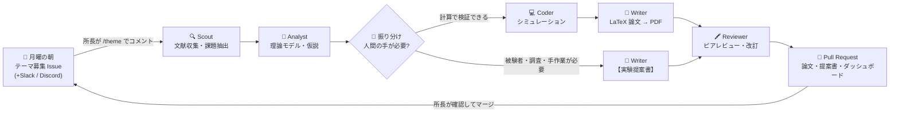

<div align="center">

# 🐍 Medusa Lab

**無人の研究室で、AIエージェントたちが毎週ひとつの研究をやり遂げる。**<br>
Autonomous multi-agent research lab — theory, simulation, LaTeX papers, peer review, and experiments for humans.

[](https://github.com/buchendschmerz/medusa-lab/actions/workflows/ci.yml)


<!-- 研究室のライブ・ダッシュボード（研究サイクルのたびに自動更新されます） -->



</div>

<!-- MEDUSA:STATUS:START -->
**テーマ:** LLMはオノマトペを接地・創発できるか ｜ **モード:** `hybrid` ｜ **状態:** 🟢 `DONE` 完了

| | エージェント | 状態 | いまやっていること | 進捗 |
|:-:|:--|:--|:--|:--|
| 🏛️ | **所長**<br><sub>人間</sub> | 👀 `YOUR TURN` 成果の確認待ち | PRで論文と実験提案書をご確認ください | |
| 🔍 | **Scout**<br><sub>論文収集と課題抽出</sub> | 🟢 `DONE` 完了 | 文献4本・課題3件を抽出 | `▰▰▰▰▰▰▰▰▰▰` 100% |
| 🧠 | **Analyst**<br><sub>理論モデル構築と仮説・実験デザイン</sub> | 🟡 `WAITING` 所長待ち | 人間向けの仮説2件は所長の出番です |  |
| 💻 | **Coder**<br><sub>数理・計算シミュレーション</sub> | 🟢 `DONE` 完了 | 計算完了：図2枚・指標8個 | `▰▰▰▰▰▰▰▰▰▰` 100% |
| 📝 | **Writer**<br><sub>LaTeX論文と実験プロトコル執筆</sub> | 🟢 `DONE` 完了 | 査読コメントを反映した提案書2件 | `▰▰▰▰▰▰▰▰▰▰` 100% |
| 🖍️ | **Reviewer**<br><sub>エージェント間ピアレビュー</sub> | 🟢 `DONE` 完了 | 判定: 軽微な修正で採択（3.37/5） | `▰▰▰▰▰▰▰▰▰▰` 100% |

**パイプライン:** ✅ テーマ受付 → ✅ 文献調査 → ✅ 理論・仮説 → ✅ 計算実験 → ✅ 論文・提案 → ✅ 査読 → ✅ 公開

<sub>文献 4 · 仮説(計算+人間) 2+2 · 図 2 · 査読 3.4/5 · 実験提案 2 · 更新 2026-09-24 23:23 UTC</sub>
<!-- MEDUSA:STATUS:END -->

---

## 🧪 Medusa Lab とは

Medusa Lab は、AIエージェントたちが **理論構築 → 計算モデル → データ分析 → 論文執筆 → 相互査読** を自律的に進める「無人研究室」フレームワークです。
裏で黙々と処理を回すだけではありません。研究室の様子は **レトロなピクセルアート（ドット絵）** でいつでも覗けて、人間であるあなた ——**所長**—— とは毎週対話しながら共同研究を進めます。

| | 機能 | 中身 |
|:-:|---|---|
| 📮 | **週間インタラクティブ・ワークフロー** | 毎週月曜の朝、GitHub Issue（＋Slack／Discord）で「所長、今週のMedusa Labの研究テーマは何にしますか？」と問いかけ。Issue に `/theme ...` とコメントするだけで研究サイクルが始まります。 |
| 🔀 | **ハイブリッド型の研究生成** | 計算で決着できる仮説は **In-Silico（完全自律）** で論文PDFと査読まで。人の手が必要な仮説は **【実験提案書】人間がやると面白い仮説＆実験プロトコル** として所長に届けます。 |
| 👾 | **ピクセルアート研究室ダッシュボード** | 各エージェントが「論文棚を探索中」「端末でカタカタ」「論文に朱入れ中」…と今何をしているかをアニメーションSVG／GIF・バッジ・ASCII表示でリアルタイムに可視化します。 |

### 研究室のメンバー

| | エージェント | 担当 | ドット絵の様子 |
|:-:|---|---|---|
| 🔍 | **Scout** | arXiv / OpenAlex で論文収集・未解決課題の抽出 | 探検帽で論文棚を虫眼鏡で探索、本を開いて読解 |
| 🧠 | **Analyst** | 理論モデル構築、仮説の設計、人間向け実験アイデア（検出力分析つき） | 黒板に数式、ひらめき電球、手をあごに思考中 |
| 💻 | **Coder** | Python 数理・計算シミュレーション（サンドボックスで実行・自己デバッグ） | ヘッドホンで端末をカタカタ、RUN のプログレスバー、バグと格闘 |
| 📝 | **Writer** | LaTeX 論文（PDF）のビルド、人間向け実験プロトコルの執筆 | タイプライターで執筆、TEX→PDF をビルド |
| 🖍️ | **Reviewer** | エージェント間ピアレビュー（3人の査読者ペルソナ＋自動チェック）と改訂指示 | クリップボードの原稿に赤ペンで朱入れ、「OK」スタンプ |
| 🏛️ | **所長（あなた）** | 毎週のテーマ決定、成果（PR・提案書）の最終判断 | 空の社長椅子とマスコットの蛇が、あなたの指示を待っています |

<details>
<summary>👾 全エージェントの状態スプライト一覧を見る</summary>



研究サイクル進行中はこんな感じです：



</details>

---

## 🔄 1週間の流れ



1. **月曜 08:00 (JST)** — `weekly_prompt.yml` がテーマ募集 Issue を作成（先週の未回答 Issue は自動クローズ）。
2. **所長が回答** — Issue にコメント:
   ```text
   /theme SNSにおける新語の拡散と言語進化
   /keywords naming game, language evolution, social network
   /mode hybrid
   /note 被験者実験のアイデアも多めにお願いします
   ```
3. **研究サイクル** — `research_cycle.yml` が起動。コメントに 👀 が付き、Issue のステータスコメントが各フェーズでライブ更新されます。
4. **成果物** — 論文（`paper.tex` / `paper.pdf`）、実験提案書、査読記録、週次レポート、更新されたピクセルアート・ダッシュボードが **Pull Request** で届きます。Issue には完了報告と PR へのリンクが投稿され 🚀 が付きます。

| コマンド | 必須 | 説明 |
|---|:-:|---|
| `/theme` | ✅ | 研究テーマ（日本語OK。次の行以降に詳しい説明を書けます） |
| `/keywords` | | 文献検索キーワード（英語推奨・カンマ区切り） |
| `/mode` | | `hybrid`（既定）／`in-silico`／`human` |
| `/note` | | エージェントへの補足・要望 |

テーマは **Actions タブからの手動実行**（workflow_dispatch）や、**`config.yaml` の `theme.current` を書き換えて main に push** しても投入できます。

### 研究モード

| モード | 動き |
|---|---|
| `in-silico` | 完全自律モード。理論モデル → シミュレーション → LaTeX 論文（PDF）→ 査読まで自動で完了。人間向け仮説は「今後の課題」として保留。 |
| `human` | 人間介入提案モード。計算はせず、被験者実験・意識調査・手作業のデータ収集が必要な「面白い仮説」と実験プロトコルだけを作成。 |
| `hybrid`（既定） | 両方。シミュレーションの予測を、人間の実験で確かめる提案まで一気通貫で。 |

振り分けは Analyst の判断に加え、「被験者」「アンケート」「participants」「survey」などの手がかりを検出するルーターが二重チェックします（計算トラックに紛れ込んだ人間向け仮説は自動で付け替え）。

---

## 🚀 はじめかた

### ローカルで試す（APIキー不要のオフラインデモ）

```bash
pip install -e ".[llm,science]"        # Claude を使う場合（オフラインのみなら pip install -e .）
python -m medusa demo                  # オフライン＆ネットワーク無しで1サイクル実行 → demo-outputs/
python -m medusa serve --outputs demo-outputs   # http://127.0.0.1:8000/ でレポートとライブ・ダッシュボード
python -m medusa status --pixel        # ターミナルにドット絵の研究室を表示（--watch でアニメーション）
```

> PDF をビルドするには TeX Live（`latexmk`・`pgfplots`、日本語テーマの場合は `luatexja`）が必要です。無い場合は `.tex` だけを出力します。

Claude を使った本番サイクル:

```bash
export ANTHROPIC_API_KEY=sk-ant-...
python -m medusa run --theme "コンサートの拍手はなぜ揃うのか" --keywords "synchronization, applause" --mode hybrid
```

### GitHub で「無人研究室」を運用する

1. このリポジトリを fork（またはテンプレートとして作成）します。
2. **Settings → Secrets and variables → Actions** に登録:
   - `ANTHROPIC_API_KEY`（未設定でもオフライン＝テンプレートモードで動きます）
   - 任意: `SLACK_WEBHOOK_URL` / `DISCORD_WEBHOOK_URL`
3. **Settings → Actions → General → Workflow permissions** で「Read and write permissions」と「Allow GitHub Actions to create and approve pull requests」を有効化。
4. あとは月曜の朝を待つだけ（すぐ試すなら Actions タブで `Weekly theme prompt` を手動実行）。
   ラベル（`medusa:theme-request` など）は自動で作成されます。

---

## 👾 ピクセルアート・ダッシュボード

`StatusBoard` がエージェントの状態遷移（思考中・探索中・コーディング中・計算実行中・デバッグ中・執筆中・ビルド中・査読中・所長待ち・完了・エラー…）を記録し、そのたびに以下を再生成します。

| 出力 | 用途 |
|---|---|
| `outputs/dashboard/lab.svg` | CSS アニメーション付きのドット絵研究室（README 埋め込み用。`prefers-reduced-motion` では静止） |
| `outputs/dashboard/lab.gif` | 同じシーンのアニメーション GIF（SVG が表示できない Slack / Discord 向け。例: [docs/assets/lab-demo.gif](docs/assets/lab-demo.gif)） |
| `outputs/dashboard/badges/*.svg` | エージェントごとのステータスバッジ |
| `outputs/dashboard/status.md` / README のブロック | Markdown のステータス表（Issue のライブコメントにも使用） |
| `outputs/dashboard/index.html` | `status.json` をポーリングするライブ・ダッシュボード（`medusa serve`） |
| `medusa status --pixel` | ターミナルに 24bit カラーのハーフブロックでドット絵を描画 |

スプライトはすべてコード内の文字グリッドで描かれており、外部画像や依存ライブラリなしで SVG / GIF（自前の LZW エンコーダ）/ ANSI に書き出せます。

---

## 📂 ディレクトリ構成

```text
medusa/
├── orchestrator.py      # 週間サイクル（月曜の問いかけ、フェーズ進行、In-Silico／人間実験の振り分け、改訂ループ、再開）
├── visualizer.py        # ピクセルアート・ダッシュボード（SVG/GIF/バッジ/Markdown/ANSI/ライブHTML）
├── agents/
│   ├── scout.py         # 論文収集（arXiv・OpenAlex）と課題抽出
│   ├── analyst.py       # 理論モデル＋仮説＋人間向け実験アイデア（検出力分析）
│   ├── coder.py         # シミュレーションの生成・静的検査・サンドボックス実行・自己デバッグ
│   ├── writer.py        # LaTeX 論文（PDF ビルド）と実験プロトコル、査読への改訂
│   └── reviewer.py      # エージェント間ピアレビュー（3ペルソナ＋自動チェック＋メタ査読）
├── routing.py           # 「人間の手が必要か」の検出と振り分け
├── llm.py               # Claude クライアント（構造化出力・適応的思考・フォールバック）／オフライン
├── sandbox.py           # 生成コードの隔離実行（AST検査・環境変数除去・rlimit・netns + nobody）
├── latex.py             # LaTeX のエスケープ／サニタイズ／Jinja テンプレート／安全なビルド
├── notifier.py          # GitHub Issue（ライブ進捗コメント）・Slack・Discord
├── report.py            # 週次 HTML レポートとアーカイブ（SVG チャート）
├── recipes/             # オフライン用の検証済み計算モデル（7種）と基礎文献
├── pixelart/            # キャンバス・ビットマップフォント・スプライト・SVG/GIF/ANSI 出力
└── runtime/medusa_sim.py  # シミュレーションが使うヘルパー API
templates/
├── paper_template.tex           # arXiv 風プレプリントの LaTeX テンプレート
├── human_proposal_template.md   # 【実験提案書】テンプレート
└── weekly_issue.md              # 月曜のテーマ募集 Issue
.github/workflows/
├── weekly_prompt.yml    # 毎週月曜：所長にテーマを尋ねる
├── research_cycle.yml   # テーマ受付 → 研究サイクル → PR
└── ci.yml               # テスト＋オフライン・デモ（PDF ビルド込み）
config.yaml              # 研究室の設定（テーマ、LLM、サンドボックス、査読…）
```

1サイクルの成果物は `outputs/weeks/<週>/` にまとまります:

```text
outputs/weeks/2026-W39/
├── scout/       literature.json, references.bib, problems.md
├── analyst/     analysis.json, model.md
├── routing.json
├── coder/       sim.py, params.json, results.json, data/*.dat, run_log.txt
├── paper/       paper.tex, paper.pdf, data/ (pgfplots が直接読む)
├── proposals/   E1-*.md, E2-*.md, README.md   ←【実験提案書】
├── review/      review.md, round*.json, proposals.json
├── report.html  summary.md  pr_body.md  dashboard.svg  cycle.json
```

---

## ⚙️ 設定

主な項目（すべて `config.yaml` で変更できます）:

| キー | 既定値 | 説明 |
|---|---|---|
| `lab.director` / `lab.language` | `所長` / `ja` | 呼び名と、ダッシュボード・通知・提案書の言語（`ja`/`en`） |
| `llm.model` | `claude-opus-5` | 使用する Claude モデル |
| `llm.effort` / `llm.thinking` | `high` / `adaptive` | 推論の深さ（適応的思考） |
| `llm.fallbacks` | `default` | 安全性分類器による拒否時のサーバー側フォールバック（Bedrock / Vertex 利用時は `null`） |
| `scout.sources` | `[arxiv, openalex]` | 文献ソース |
| `coder.sandbox` | `basic` | `strict` でネットワーク遮断＋`nobody` 実行（CI は `MEDUSA_SANDBOX=strict`） |
| `coder.max_attempts` | `3` | 生成コードの自己デバッグ回数 |
| `writer.paper_language` | `en` | 論文の言語（`ja` なら LuaLaTeX + luatexja） |
| `reviewer.personas` | 3人 | `methodologist` / `domain_expert` / `skeptic` |
| `reviewer.max_revision_rounds` | `2` | 大幅修正時の改訂ラウンド上限 |

環境変数: `MEDUSA_OFFLINE=1`（LLM なし）、`MEDUSA_NO_NETWORK=1`、`MEDUSA_SANDBOX=strict`、`MEDUSA_MODEL=...`、`MEDUSA_QUICK=1`。

### LLM について

`ANTHROPIC_API_KEY`（または Claude の認証プロファイル）があれば、各エージェントは Anthropic SDK 経由で Claude を使います（ストリーミング、適応的思考、JSON スキーマによる構造化出力、査読では論文本文をプロンプトキャッシュで共有）。
認証情報が無い環境では **オフライン・モード** に切り替わり、テーマに合う検証済みレシピ（ネーミングゲーム、意見力学、ネットワーク拡散、蔵本モデル、空間囚人のジレンマ、シェリング分居、サイモン／Zipf）で同じサイクルを決定論的に回します。LLM が書いたコードが何度直しても動かない場合も、このレシピに退避して研究を継続します（論文にもその旨が明記されます）。

---

## 🛡️ 安全性と研究倫理

- **生成コードの隔離**: AST による import 許可リスト・危険な組み込み関数／dunder／ファイル・プロセス系 API の禁止 → 秘密情報を除いた環境変数・rlimit・タイムアウト付きのサブプロセス。CI の `strict` モードではさらに **ネットワーク名前空間なし＋`nobody` ユーザー** で実行し、出力はシンボリックリンクを辿らずに回収します。
- **LaTeX の強化**: モデルが書いた文章は許可リスト方式でサニタイズ（`\input`・`\write18`・`\directlua` 等は無害化）し、ビルドは `shell_escape=f`・`openin_any=p`・`openout_any=p` で実行。
- **プロンプトインジェクション対策**: 取得した論文要旨は「データ」として区切って渡し、指示として扱わないよう明示。Issue コメントは信頼できるコラボレーターの `/theme` のみを受け付け、ワークフローでは未検証テキストを環境変数経由でのみ扱います。
- **研究倫理**: すべての論文に「AI 生成・人間未査読」の表示を入れ、引用は実際に取得した文献（またはモデルの基礎文献）のみに限定。実験提案書には検出力分析・倫理チェックリスト・事前登録の手順を含め、**実施やマージの判断は必ず所長（人間）が行います**。

---

## 🧑‍💻 開発

```bash
pip install -e ".[llm,science,dev]"
ruff check .
pytest                                 # LaTeX が入っていれば PDF ビルドのテストも実行
python -m medusa gallery               # README 用のデモ画像（docs/assets）を再生成
python -m medusa recipes               # オフライン・レシピの一覧
```

## License

MIT © Dai Miyazaki
